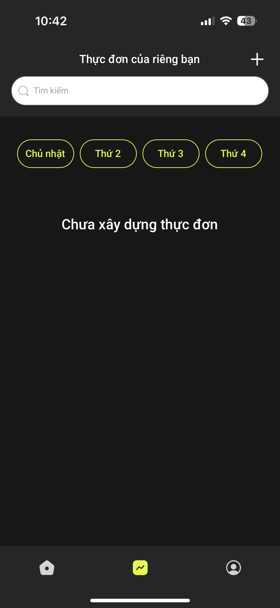
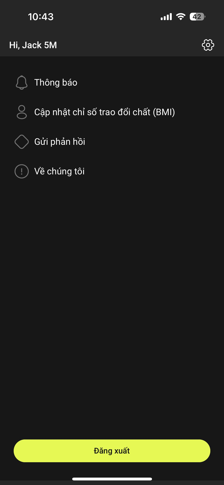
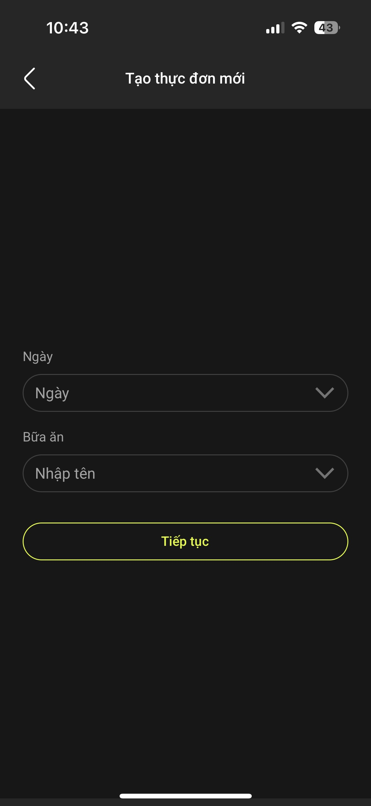
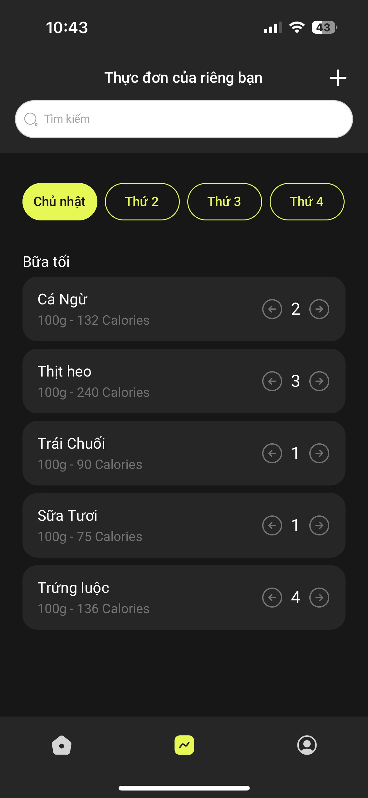
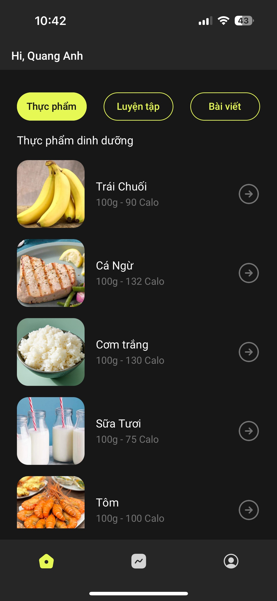
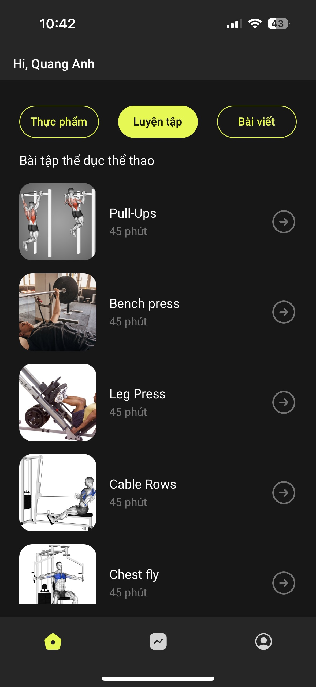

# NutriFit

# DEMO-App

https://drive.google.com/file/d/1EN8npYYF-5bNZkYz1MBtZuqzh2l_EGii/view?usp=sharing

## Table of Contents

-   [Table of Contents](#table-of-contents)
    -   [About](#about)
    -   [Features](#features)
    -   [Screenshots](#screenshots)
    -   [Getting Started](#getting-started)
        -   [Prerequisites](#prerequisites)
        -   [Installation](#installation)

## About
The NutriFit app is a software aimed at beginner gymgoers who are attempting to change their lives through physical endeavors. It offers educational articles about what every beginner needs to know before starting their journey, along with nutritional and dietary data/statistics to help them build a better diet. The app's goal is to impact those who are starting to go to the gym, but are unsure of what to do.

          
## Features
-Workouts
-Food values
-Educational Articles
-Planning

## Screenshot
<p float='left'>









</p>


## Getting Started

## Prerequesites

-   Node.Js: https://nodejs.org/en
-   Expo: https://docs.expo.dev/get-started/installation/
-   Yarn: https://classic.yarnpkg.com/lang/en/docs/install/#mac-stable
  
## Installation

-   Clone the repository to your local machine
-   Install dependencies using npm or yarn
-   Run the app using `yarn start` or another suitable command

```bash
git clone https://github.com/JohnThuan/sportify.git
cd expo-tech-app
yarn
yarn start
```

